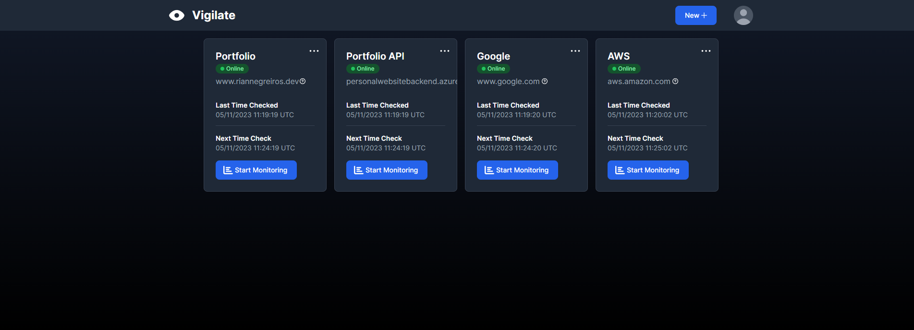

# Vigilate

Vigilate is Full-Stack application for users to get updated with they web services health

## Libraries and Tools

- [Go](https://go.dev/doc/install)
- [Echo web framework](https://echo.labstack.com)
- [Golang Migrate](https://github.com/golang-migrate/migrate)
- [JSON Web Tokens](https://jwt.io/introduction)
- [Next.js](https://nextjs.org/docs)
- [Typescript](https://www.typescriptlang.org/docs)
- [Tailwind CSS](https://tailwindcss.com/docs/installation)
- [Docker](https://docs.docker.com)
- [Docker compose](https://docs.docker.com/compose/gettingstarted)
- [PostgreSQL](https://www.postgresql.org/about)
- [Apache Kafka](https://kafka.apache.org/intro)
- [Pusher Channels](https://pusher.com/docs/channels/getting_started/javascript)
- [Resend](https://resend.com/docs/introduction)

## Principles

- SOLID
- Don't Repeat Yourself
- You Aren't Gonna Need It
- Keep It Simple
- Small Commits

## Author

Rian Negreiros Dos Santos

